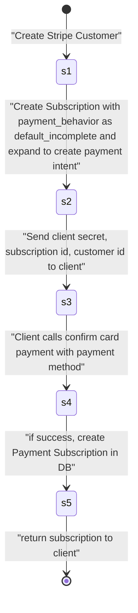

# External service

This is the place for **ALL** external services integration.

## 1) Expose credentials

Development: _(optional)_

```
/.env.development
```

Production:

```
/aws/production-us-east-1
```

Always keep documentation about where the key was taken from

```
# Taken from: [url to where those credentials are taken]
[sevice_name]_token: [...]
[sevice_name]_secret: [...]
```

_Don't use directly in application._ Use only in `External::[Service]Api`.

## 2) Wrap service in a module name `External::[Service]Api`:

```ruby
# frozen_string_literal: true

# Documentation
#
# - service: [url to service]
# - manage: [url to manage tokens]
# - api: [url api documentation]
# - gem: [gem we are using (optional)]
# [- ... other links]

module External::[Service]Api
  extend self

  # documentation: [documentation]
  def perform_action(args)
    # use HTTParty or gem for this external service
  end

end
```

## 3) Use wrap module:

**Don't** use the external service directly.

```ruby

External::[Service]Api.perform_action('docs')
```

## 4) [Optional] Persist API responses

Sometimes, services will charge per API call. We maintain a table of API calls as cache for this purpose, checkout [api_response.rb](app/models/externals/api_response.rb)


### Stripe Founder Club Subscriptions Flow

